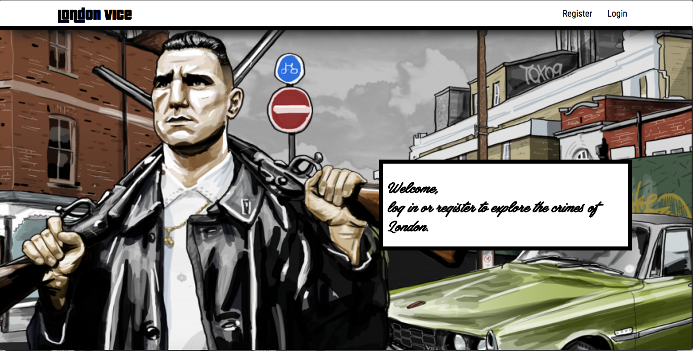
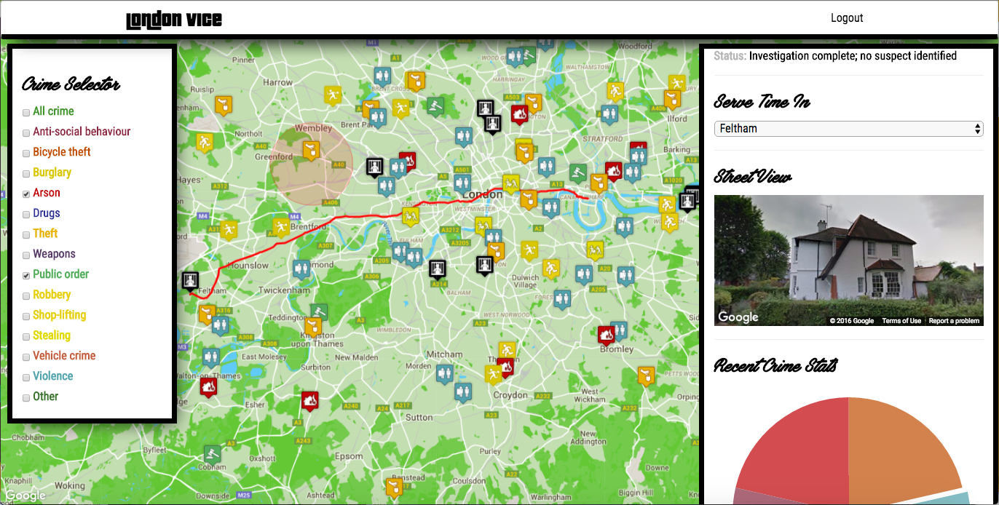
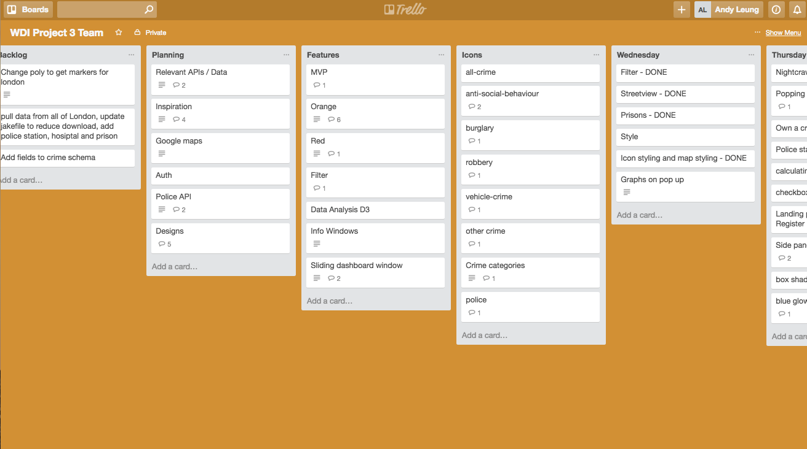
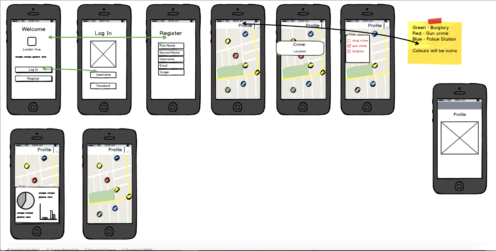

<h1>London Vice</h1>
<h2>Raising awareness in the community</h2>
[LondonVice](https://london-vice.herokuapp.com/)

<h2>Problems that we are solving</h2>
<li>There is a lack of awareness of the type of crime, location and status of the criminal activity in London.</li>
<li>The exisitng available information is not easily accessible or visually appealing.</li>

<h2>Key Features</h2>
<li>User registration</li>
<li>Crime selection filter</li>
<li>Overview for crime and prison locations</li>
<li>Dashboard for detailed crime information</li>
<li>Street view to allow onsite viewing</li>
<li>Route selector to show direction to prison</li>
<li>Dynamic update on statistics on crimes around the selected area</li>

<h2>Technologies used</h2>
<h3>Planning</h3>
<li>Trello</li>

<li>Balsamiq</li>

<li>Verbal communications and daily standup</li>
<li>Pen and paper</li>

<h3>MEN Stack</h3>
<li>HTML, CSS, Javascript</li>
<li>MongoDB</li>
<li>Express</li>
<li>Node.js</li>

<h3>Node Modules</h3>
<li>Mongoose</li>
<li>JSON Web Token (JWT)</li>
<li>Passport.io</li>
<li>Underscore.js</li>
<li>bcrypt-nodejs</li>
<li>body-parser</li>
<li>cors</li>
<li>jake</li>
<li>method-override</li>
<li>morgan</li>
<li>request-promise</li>
<li>validator</li>
<li><a href="https://www.npmjs.com/">npm</a></li> 
<li><a href="http://bower.io/">Bower</a></li> 

<h3>API</h3>
<li>Google Map API - Javascript, Streetview, Direction Service, Geometry Library</li>
<li><a href="https://data.police.uk/docs/">Police API</a></li>
<li><a href="http://www.highcharts.com/">Highcharts</a></li>

<h3>Frontend styling</h3>
<li>Bootstrap</li>
<li>jQuery</li>
<li><a href="https://snazzymaps.com/">Snazzy Maps</a></li>
<li>Google Fonts</li>
<li><a href="https://www.fontsquirrel.com/">Font Squirrel</a></li>
<li>Noun Project</li>

<h2>Credits</h2>
<li>Developed by Andy Leung, Patrick de Klee, Rosanna Rossington</li>
<li>With support from General Assembly London WDI support</li>
<li>Alex Chin for the icon styling</li>
<li>All photos and videos links belong to the original uploader</li>
